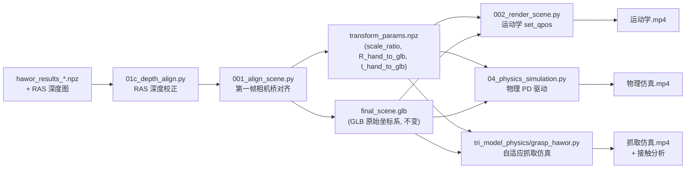
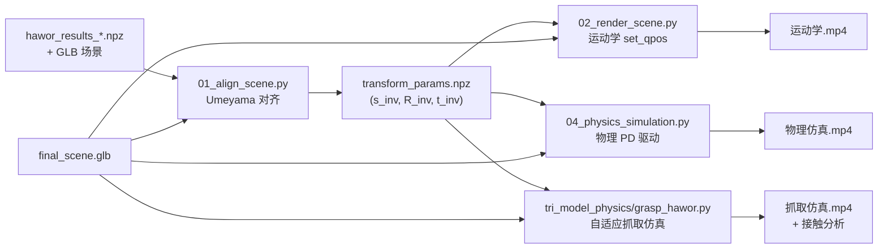
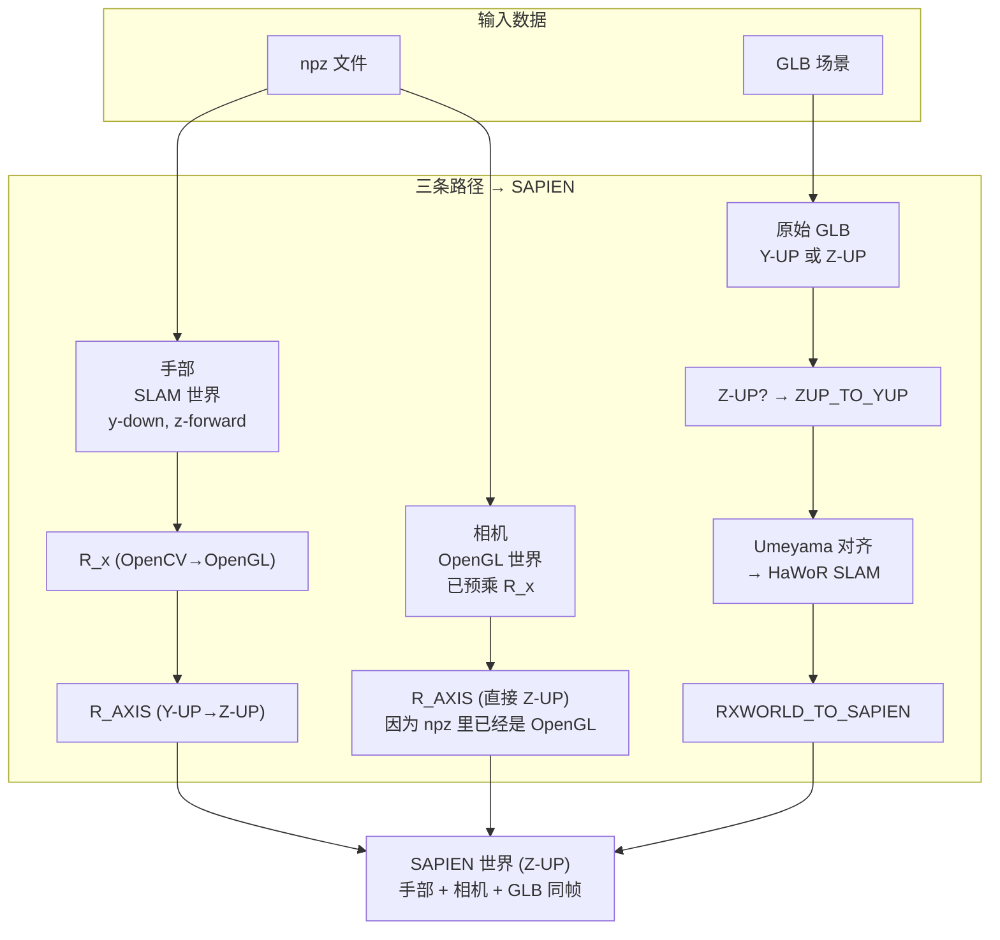
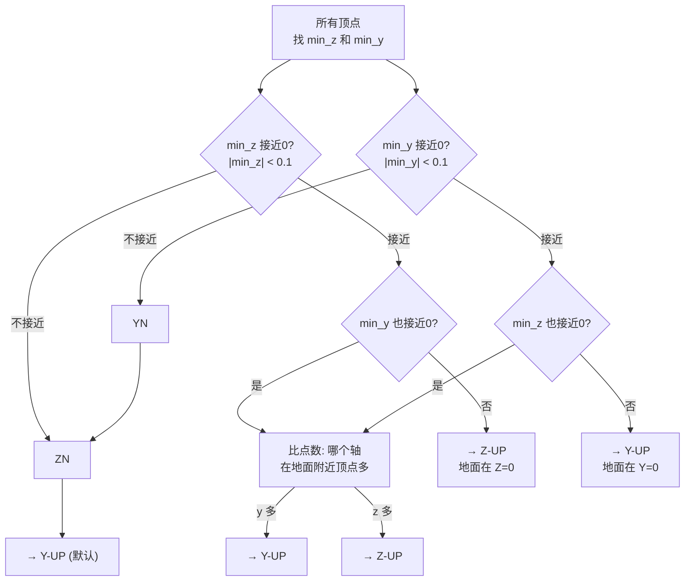
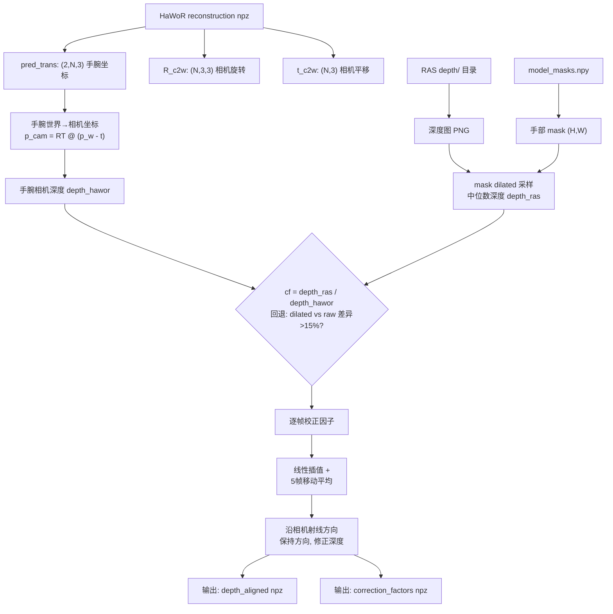
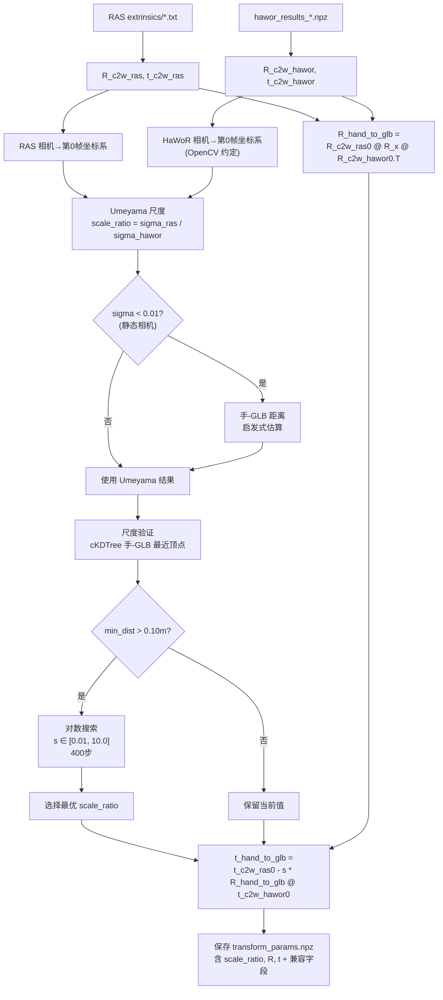
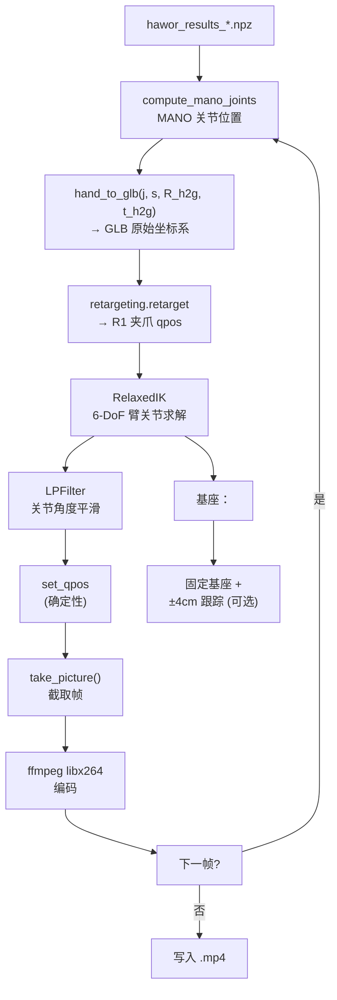
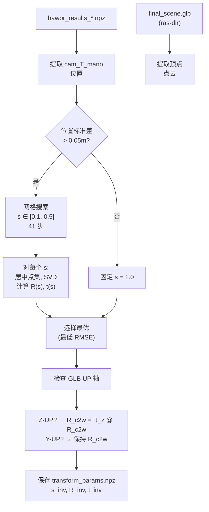
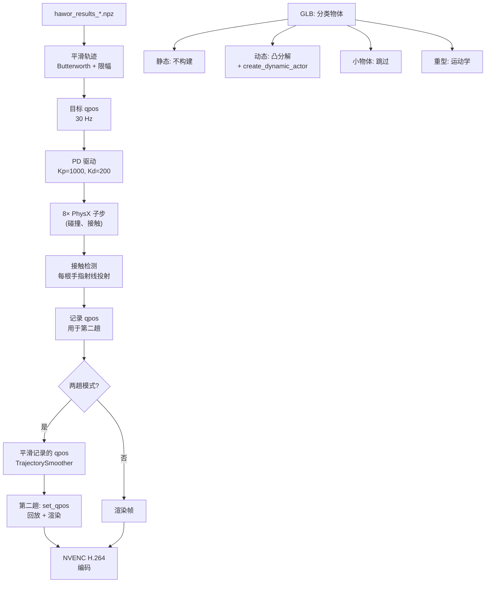
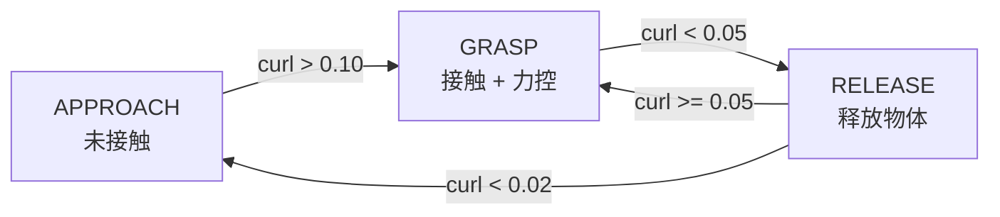

# Dex-Retargeting 管线：系统架构分析

> 对 `example/combination/` 中管线的全面分析。
> 涵盖新旧两套坐标管线、深度校正、运动学渲染、物理仿真及自适应抓取。
> 新管线：01c → 001 → 002（第一帧相机坐标系为桥，GLB 保持原始坐标系）
> 旧管线：01 → 02 → 04（Umeyama 对齐 + SAPIEN Z-UP）

---
## 1. 管线概览

本管线将原始 MANO 手部跟踪数据转换为两种类型的渲染输出：
运动学（确定性、理想运动）视频和基于物理（真实、带碰撞检测）的视频。

### 1.1 新旧两套并行管线

项目中存在两套并行管线，分别使用不同的坐标对齐策略：

| 管线 | 对齐脚本 | 渲染脚本 | 坐标哲学 |
|------|---------|---------|---------|
| **新坐标管线** | `001_align_scene.py` | `002_render_scene.py` | 第一帧相机坐标系为桥，GLB 保持原始坐标系 |
| **旧坐标管线** | `01_align_scene.py` | `02_render_scene.py` | Umeyama 对齐后转 SAPIEN Z-UP |

**建议使用新坐标管线**，因为它避免了复杂的坐标转换链，直接使用 GLB 原始坐标系。

### 1.2 管线阶段总览

| 阶段 | 脚本 | 用途 | 输出 |
|-------|--------|---------|--------|
| 0 | `01c_depth_align.py` | RAS 深度图校正 HaWoR 手部深度（可选预处理） | `hawor_results_depth_aligned.npz` |
| 1a | `001_align_scene.py` | **新** 第一帧相机坐标系为桥对齐 GLB ↔ HaWoR | `transform_params.npz` |
| 1b | `01_align_scene.py` | **旧** Umeyama 对齐相机与场景 | `transform_params.npz` |
| 2a | `002_render_scene.py` | **新** 运动学渲染（GLB 原始坐标系） | `.mp4` 视频 |
| 2b | `02_render_scene.py` | **旧** 运动学渲染（SAPIEN Z-UP） | `.mp4` 视频 |
| 3 | `04_physics_simulation.py` | 物理仿真 (PD 驱动) | `.mp4` 视频 |
| 独立 | `tri_model_physics/grasp_hawor.py` | 自适应抓取仿真 (R1 + SAPIEN) | `.mp4` + 接触分析 |

阶段 2 和阶段 3 均使用阶段 1 输出的 `transform_params.npz`。

`tri_model_physics/grasp_hawor.py` 是独立的抓取专项仿真模块，不依赖阶段 2 或阶段 3，但共享阶段 1
输出的 `transform_params.npz` 作为坐标对齐基础。它支持 `full_robot`（全机器人 + RelaxedIK）
和 `gripper_only`（纯夹爪 + 解析映射）两种 URDF 模式，以及 `hybrid`、`adaptive`、`mano` 三种抓取策略。

### 1.3 新管线数据流



### 1.4 旧管线数据流

旧管线使用 Umeyama 相似变换将场景和手部对齐到 SAPIEN Z-UP 坐标系：



### 1.5 一键管线

`00_run_pipeline.py` 提供四种预配置的管线模式：

| 模式 | 命令 | 管线步骤 |
|------|------|---------|
| `full`（旧坐标） | 默认 | 01 → 02(4个mode) → 04 |
| `full-depth` | `--depth-align` | 01c → 01 → 02(4个mode) → 04 |
| `align-render`（新坐标） | `--mode align-render` | 001 → 002 |
| `align-render-depth` | `--mode align-render --depth-align` | 01c → 001 → 002 |

---
## 2. 坐标系架构

### 2.1 新坐标系哲学 (001/002 管线)

新管线采用**完全不同的坐标哲学**：不改变任何坐标系的 UP 轴，保留 GLB 的原始坐标系，通过第一帧相机坐标系作为桥梁将 HaWoR 数据映射到 GLB 坐标系。

**核心思想**：
- RAS 和 HaWoR 处理同一个视频，第一帧相机在两个系统中描述同一个物理相机
- 以第一帧相机坐标系为公共桥梁，把 HaWoR 手部数据映射到 GLB 原始坐标系
- GLB 保持原始坐标系不变（不检测 up axis，不做 ZUP_TO_YUP 转换）

**变换链 (HaWoR render world → GLB 原始坐标系)**：

```
Step 1: p_hawor → 第一帧 HaWoR 相机坐标系 (OpenGL)
        p_cam_gl = R_c2w_hawor[0].T @ (p_hawor - t_c2w_hawor[0])

Step 2: OpenGL → OpenCV 相机约定 (Y轴和Z轴翻转)
        p_cam_cv = R_x @ p_cam_gl
        R_x = diag(1, -1, -1)

Step 3: 第一帧 OpenCV 相机坐标系 → GLB 原始坐标系 (用 RAS 第一帧)
        p_glb = scale_ratio * R_c2w_ras[0] @ p_cam_cv + t_c2w_ras[0]
```

**合并后的完整变换**：

```
R_hand_to_glb = R_c2w_ras[0] @ R_x @ R_c2w_hawor[0].T
t_hand_to_glb = t_c2w_ras[0] - scale_ratio * R_hand_to_glb @ t_c2w_hawor[0]
p_glb = scale_ratio * R_hand_to_glb @ p_hawor + t_hand_to_glb
```

**尺度估计 (scale_ratio)**：
```
scale_ratio = sigma_ras / sigma_hawor
```
把 RAS 相机轨迹和 HaWoR 相机轨迹都映射到第一帧相机坐标系 (OpenCV 约定)，
用 Umeyama 算尺度比。静态相机时（轨迹标准差过小）用手-GLB 距离启发式估算。

### 2.2 旧坐标系约定 (01/02/04 管线)

旧管线经历了 3 次坐标变换：OpenCV 约定 → OpenGL 约定 → SAPIEN 约定。

```
OpenCV 约定 (SLAM 世界)           OpenGL 约定 (Y-UP)              SAPIEN 约定 (Z-UP)
┌──────────────┐                 ┌──────────────┐                ┌──────────────┐
│ X ← 右       │                 │ X ← 右       │                │ X ← 右       │
│ Y ← 上       │──R_x=diag──→   │ Y ← −Y(下→上)│──R_AXIS──→    │ Z ← Y(上)    │
│ Z ← 前       │(1,-1,-1)       │ Z ← −Z(前→后)│ 绕X轴-90°     │ Y ← −Z(后)   │
└──────────────┘                 └──────────────┘                └──────────────┘
```

关键矩阵：
- **R_x = diag(1,-1,-1)**：把 Y 和 Z 的方向翻过来（上变下，前变后），OpenCV ↔ OpenGL 互转。
- **R_AXIS = [[1,0,0],[0,0,1],[0,-1,0]]**：绕 X 轴旋转 -90°，把 OpenGL 的 Y-UP 变成 SAPIEN 的 Z-UP。
- **RXWORLD_TO_SAPIEN = R_AXIS @ R_x**：合起来就是 SLAM 世界 → SAPIEN 世界。

### 2.3 旧管线三路数据汇聚到 SAPIEN



### 2.4 坐标系对照

| 坐标系 | 约定 | 使用场景 |
|-------|------|---------|
| HaWoR SLAM 世界 | OpenCV: y-上, z-前 | npz 中手部关键点 (`pred_trans`, `pred_rot`) |
| OpenGL 世界 | Y-UP: y-上, z-后 | npz 中相机位姿 (`R_c2w`, `t_c2w`) |
| GLB 原始坐标系 | 可能是 Y-UP 或 Z-UP | RAS 重建的场景文件 |
| SAPIEN 世界 (旧管线) | Z-UP: z-上, y-后 | 01/02/04 最终渲染帧 |
| GLB 原始坐标系 (新管线) | 保持 GLB 不变 | 001/002 直接使用 |

### 2.5 GLB 的 UP 轴检测（旧管线）

旧管线 (`01_align_scene.py` / `02_render_scene.py`) 需要检测 GLB 的 UP 轴：



**新管线 (`001_align_scene.py`) 不做 UP 轴检测**，GLB 保持原始坐标系不变。

---
## 3. 阶段 0：01c_depth_align.py — RAS 深度图校正 HaWoR 手部深度

### 3.1 目的

HaWoR 手部深度基于弱透视 (`tz = 2 * focal / bs`)，误差较大；
RAS 深度图基于 VGGT pointmap 回归，误差较小。
本脚本用 RAS 深度图沿相机射线方向校正 HaWoR 手部深度。

**必须在 001_align_scene.py / 01_align_scene.py 之前运行**，
输出校正后的 reconstruction npz，后续步骤使用校正后的数据。

### 3.2 输入 / 输出

| 符号 | 描述 | 形状 / 类型 |
|--------|-------------|--------------|
| `hawor_results_*.npz` | HaWoR 重建输出 | NumPy .npz 字典 |
| `model_masks.npy` | HaWoR 手部 mask 序列 | (N, H, W) numpy 数组 |
| `ras_dir/depth/*.png` | RAS 深度图序列 | uint16 PNG |
| `hawor_results_depth_aligned.npz` | 校正后的重建数据 | NumPy .npz 字典 |
| `depth_correction_factors.npz` | 每帧校正因子 | NumPy .npz |

### 3.3 核心算法

#### HaWoR 手腕深度计算

将手腕世界坐标转换到相机坐标系，取欧氏距离：
```python
wrist_cam = R_c2w[fi].T @ (wrist_3d - t_c2w[fi])
depth_hawor = ||wrist_cam||
```

#### RAS 深度提取

从 RAS 深度图提取手部区域的**中位数深度**：

1. 如果 mask 和 depth 图分辨率不一致，resize mask 到 depth 图分辨率
2. 用 dilation（5×5 椭圆核，1 次迭代）扩大 mask 采样区域，提升低分辨率深度图下的鲁棒性
3. 取原始 mask 的中位数深度作为基准
4. 取 dilated mask 的中位数深度
5. **回退机制**：如果 dilated 中位数和原始 mask 中位数差异 > 15%，说明混入了背景噪声，回退到原始 mask
6. 最终深度 = 中位数像素值 / depth_scale（默认 1000，即 mm → m）

#### 帧对应关系

```
pairs = [(ras_idx, round(ras_idx * (n_hawor - 1) / (n_ras - 1))) for ras_idx in range(n_ras)]
```

#### 校正因子插值

1. 在直接对应的帧上计算 `cf = depth_ras / depth_hawor`
2. 线性插值到所有 HaWoR 帧
3. 低通滤波（5 帧移动平均），减少校正因子跳变

#### 深度校正原理

```python
# 保持视线方向不变，只改深度
# 1. 世界→相机: p_cam = R^T @ (p_world - t)
# 2. 提取视线方向: direction = p_cam / |p_cam|
# 3. 用 RAS 深度替换: new_depth = old_depth * cf
# 4. 新相机坐标: p_cam_new = direction * new_depth
# 5. 相机→世界: p_world_new = R @ p_cam_new + t
```

### 深度校正流程图



### 3.4 输出产物

- `hawor_results_depth_aligned.npz`：深度校正后的 MANO 参数（`pred_trans` 已被修改）
- `depth_correction_factors.npz`：每帧校正因子（含 `factors`, `hand_idx`, `avg_cf`, `n_valid_frames`）

### 3.5 关键特性

- **仅校正位置**：只修改 `pred_trans`（手腕世界坐标），不修改旋转 `pred_rot` 或手型 `pred_hand_pose`
- **射线方向保持**：沿相机射线方向缩放深度，不改变视线方向
- **单/双手支持**：通过 `--hand-idx` 指定校正哪只手，默认自动检测
- **Dry-run 模式**：只计算和预览校正因子，不保存文件
- **HaWoR 目录自动查找**：支持 `--hawor-dir` 自动定位 reconstruction npz 和 model_masks

---
## 4. 阶段 1a：001_align_scene.py — 第一帧相机坐标系对齐（新管线）

### 4.1 目的

以第一帧相机坐标系为桥梁，将 HaWoR 手部数据对齐到 GLB 原始坐标系。
GLB 保持原始坐标系不变（不做 UP 轴检测和转换）。

### 4.2 核心原理

RAS 和 HaWoR 处理同一个视频，第一帧相机在两个系统中描述同一个物理相机。
以第一帧相机坐标系为公共桥梁：

```
R_hand_to_glb = R_c2w_ras[0] @ R_x @ R_c2w_hawor[0].T
t_hand_to_glb = t_c2w_ras[0] - scale_ratio * R_hand_to_glb @ t_c2w_hawor[0]
p_glb = scale_ratio * R_hand_to_glb @ p_hawor + t_hand_to_glb
```

### 4.3 输入 / 输出

| 符号 | 描述 | 形状 / 类型 |
|--------|-------------|--------------|
| `ras_output/extrinsics/*.txt` | RAS 外参（每帧 3×4 矩阵） | 文本文件序列 |
| `ras_output/final_scene.glb` | RAS 重建的 3D 场景 | GLB 二进制 |
| `hawor_results_*.npz` | HaWoR 重建输出 | NumPy .npz 字典 |
| `transform_params.npz` | 对齐参数 | NumPy .npz 字典 |

`transform_params.npz` 包含字段：

| 字段 | 描述 |
|-------|--------|
| `scale_ratio` | GLB/HaWoR 尺度比 (float) |
| `R_hand_to_glb` | HaWoR → GLB 旋转矩阵 (3,3) |
| `t_hand_to_glb` | HaWoR → GLB 平移向量 (3,) |
| `R_c2w_ras0` | RAS 第一帧相机旋转 (3,3) |
| `t_c2w_ras0` | RAS 第一帧相机位置 (3,) |
| `R_c2w_hawor0` | HaWoR 第一帧相机旋转 (3,3) |
| `t_c2w_hawor0` | HaWoR 第一帧相机位置 (3,) |
| `s_inv` | 兼容旧脚本的逆缩放因子 |
| `R_inv` | 兼容旧脚本的旋转矩阵 |
| `t_inv` | 兼容旧脚本的平移向量 |
| `R_align` | 同 `R_hand_to_glb` |
| `t_align` | 未缩放的平移向量 |
| `t_align_scaled` | 同 `t_hand_to_glb` |

### 4.4 核心算法步骤

#### Step 1: 加载 RAS 第一帧相机位姿
- 从 `ras_output/extrinsics/` 读取所有外参文件
- 每个文件为 3×4 矩阵（世界→相机），解析为 R_c2w 和 t_c2w

#### Step 2: GLB 映射到第一帧相机坐标系（仅用于尺度计算）
```python
p_cam0_ras = R_c2w_ras[0].T @ (p_glb - t_c2w_ras[0])
```

#### Step 3: HaWoR 映射到第一帧相机坐标系
```python
p_cam0_hawor = R_x @ R_c2w_hawor[0].T @ (p_hawor - t_c2w_hawor[0])
```

#### Step 4: Umeyama 尺度对齐

把两个系统的相机轨迹都映射到第一帧相机坐标系，用 Umeyama 算尺度比：

```python
ras_cam_in_cam0[i] = R_c2w_ras[0].T @ (t_c2w_ras[i] - t_c2w_ras[0])
hawor_cam_in_cam0[i] = R_x @ R_c2w_hawor[0].T @ (t_c2w_hawor[i] - t_c2w_hawor[0])

sigma_src = sqrt(mean(sum(hawor_centered^2)))
sigma_dst = sqrt(mean(sum(ras_centered^2)))
scale_ratio = sigma_dst / sigma_src
```

#### 静态相机回退

当相机轨迹标准差 < 0.01m 时，Umeyama 不可靠，使用**手-GLB 距离启发式估算**：
```python
# 用未缩放变换把手变换到 GLB
hand_in_glb_unscaled = R_hand_to_glb @ hand_mean + t_unscaled
dist_unscaled = ||hand_in_glb_unscaled - glb_center||
scale_ratio = dist_expected / dist_unscaled  # dist_expected ≈ 0.15m
```

#### 尺度验证

使用 cKDTree 计算手部关键点到 GLB 场景顶点的最近距离：
- 如果 `min_distance > 0.10m`，在 `[0.01, 10.0]` 范围内以 400 步对数搜索更优 scale_ratio
- 选择使手-GLB 最近顶点距离最小的 scale_ratio

### 对齐算法流程图



### 4.5 关键特性

- **无 UP 轴检测**：GLB 保持原始坐标系，不做 ZUP_TO_YUP 转换
- **第一帧相机桥梁**：避免复杂的多步坐标转换链
- **双重尺度验证**：Umeyama + 手-GLB 距离验证 + 对数搜索优化
- **兼容旧字段**：输出同时包含新旧字段名（`R_hand_to_glb` + `R_inv`/`R_align`）
- **导出为函数**：`compute_and_save_transform_params()` 可被其他脚本直接调用
- **对齐报告**：自动生成 `alignment_report.txt` 包含完整对齐参数和验证结果

---
## 5. 阶段 2a：002_render_scene.py — 新坐标系运动学渲染

### 5.1 目的

使用新坐标系（GLB 原始坐标系）生成机器人手跟踪录制的 MANO 运动的视频。
与 `001_align_scene.py` 配套使用。

### 5.2 坐标哲学

```
旧 02: GLB → ZUP_TO_YUP → s_inv(R_inv@v + t_inv) → RXWORLD_TO_SAPIEN
新 002: GLB 原样加载, HaWoR 数据通过 transform_params.npz
        (scale_ratio, R_hand_to_glb, t_hand_to_glb) 映射到 GLB 坐标系
```

### 5.3 核心函数

#### `render_robot_video` — R1 单臂机器人视频

完整的 R1 机器人臂渲染流程（IK 求解 + 夹爪跟踪）：

1. **加载数据**：从 HaWoR 目录加载手部跟踪数据 + 相机位姿
2. **创建场景 + 加载 GLB**：使用 `load_glb_direct()` 原样加载 GLB
3. **加载 R1 机器人 URDF**：使用 `prepare_arm_urdf()` 准备浮动基座 URDF
4. **初始化 Retargeting + IK**：配置 MANO → R1 重定位 + RelaxedIK 求解器
5. **Warm start**：用首帧有效数据初始化重定位
6. **放置机器人 + Warmup**：计算最优固定基座位置，smoothstep 过渡
7. **渲染视频**：逐帧 IK 求解 + 关节滤波 + 视频编码

#### `render_gripper_video` — 夹爪末端跟踪视频

只渲染 MANO 关键点（3 个球体标记），不加载机器人 URDF。

#### `render_gripper_only_video` — 夹爪 URDF 视频

渲染只有夹爪（或夹爪+半臂）的 URDF 视频，支持两种对齐策略：

- **`aligned`（新策略）**：先对齐夹爪两点连线方向，再拟合手腕位置
- **`analytical`（旧策略）**：Gram-Schmidt 正交化构建坐标系

#### `render_dual_gripper_video` — 双夹爪 URDF 视频

同一场景中左右夹爪同时渲染。

#### `render_dual_robot_video` — 双臂 R1 视频

同一场景中左右 R1 臂同时渲染（独立 IK 求解 + 共享相机）。

### 5.4 渲染模式 (CLI `--mode`)

| 模式 | 描述 | 调用函数 |
|------|------|---------|
| `robot_tracking` | 单臂 R1 + IK 跟踪 MANO | `render_robot_video` |
| `hand_only` | 仅 MANO 关键点球体 | `render_gripper_video` |
| `robot_only` | 夹爪 URDF（无 IK） | `render_gripper_only_video` |
| `topdown` | `robot_only` + 俯视相机 | `render_gripper_only_video`（view=topdown） |
| `gripper_only` | 夹爪 URDF + 多子模式 | 见下方说明 |

### 5.5 `gripper_only` 模式的子模式 (`--gripper-mode`)

| 子模式 | 描述 |
|--------|------|
| `gripper` | 仅夹爪 URDF（无手臂） |
| `gripper_arm` | 夹爪 + 半臂 URDF |
| `both` | 同时渲染两种（分别输出） |

### 5.6 对齐策略 (`--strategy`)

| 策略 | 描述 |
|------|------|
| `aligned`（默认） | 新策略：先对齐夹爪两点连线，再拟合手腕位置。`open_scale` 控制开合缩放 |
| `analytical` | 旧策略：Gram-Schmidt 正交化构建坐标系 |

### 5.7 自动手部检测

`detect_hands()` 根据 HaWoR 数据自动检测可用的手部索引：
- 双手有效 → `hand_indices = [0, 1]` → 调用 `render_dual_robot_video` 或 `render_dual_gripper_video`
- 单只手 → `hand_indices = [idx]` → 单臂渲染

### 5.8 场景设置

| 参数 | 值 |
|-----------|-------|
| 渲染器 | SAPIEN Vulkan 位姿查看器，1920×1080 分辨率 |
| 显示模式 | 无头（无窗口）或显示（交互式 Viewer） |
| 场景光照 | 环境光 + 方向光 |
| 地面 | y = -0.5 处的半透明网格 |
| GLB 加载 | `load_glb_direct()` 原样加载，**不做 UP 轴转换** |

### 5.9 机器人 URDF 加载

- **机器人**：R1（8 自由度），浮动基座 URDF
- **安装**：机器人基座通过 `_compute_optimal_fixed_base` 放置在手腕轨迹质心处
- **关节**：6 个手臂关节 + 2 个夹爪关节
- **驱动**：stiffness=100000, damping=10000

### 5.10 动画循环

每帧处理流程（robot_tracking 模式）：

1. **MANO 关键点计算**：从 `pred_rot`, `pred_hand_pose`, `pred_trans` 计算 MANO 关节位置
2. **坐标变换**：`hand_to_glb(j, s, R_h2g, t_h2g)` → GLB 原始坐标系
3. **关键点可视化**：`_render_keypoints` 渲染 3 个目标关键点（手腕 + 两指尖）
4. **Retargeting**：`retargeting.retarget(ref_value)` → R1 机器人 qpos
5. **IK 求解**：`RelaxedIKSolver` → 6-DoF 臂关节角度
6. **关节滤波**：`LPFilter(alpha=0.3)` 平滑关节角度
7. **设置关节位置**：`robot.set_qpos(qpos)` — 确定性、即时生效
8. **渲染**：通过 `camera.take_picture()` 截取 PNG 截图

### 5.11 基座策略

- **固定基座**（默认）：`_compute_optimal_fixed_base` 计算手腕轨迹质心
- **跟踪基座**：`--fixed-base` 标志关闭时，通过 `_compute_tracking_base_pos` 在 `BASE_TRACKING_RANGE = 0.04m` 范围内跟踪手腕

### 5.12 热身过渡

动画开始时，机器人通过 smoothstep 插值在 `WARMUP_FRAMES`（默认 30 帧）内从初始位姿过渡到第一个跟踪位姿：
```python
t = frame / WARMUP_FRAMES
t = t * t * (3 - 2 * t)  # smoothstep 函数
interp = init * (1 - t) + first_valid * t
```

### 5.13 视频编码

| 参数 | 值 |
|-----------|-------|
| 编码器 | ffmpeg libx264 (通过 PyAV) |
| 格式 | MP4 |
| CRF | 18（默认） |
| 像素格式 | `yuv420p` |
| 帧率 | 30 FPS（默认） |
| 分辨率 | 1920 × 1080 |

### 5.14 相机视角

| 视角 | 位置 | 描述 |
|------|----------|---------|
| FPV（默认） | HaWoR 相机轨迹 | 第一人称视角 |
| Behind | 机器人后方 +2.5m, +1.2m | 经典第三人称 |
| Front | 机器人前方 -2.5m, +1.2m | 正面视角 |
| Topdown | 手腕质心上方 +1.2m | 俯视全局视角 |
| Default | 手腕质心偏移 (-0.15, -0.20, +0.10) | 自适应视角 |

### 5.15 验证模式

`render_gripper_only_video` 支持 `--verify` 标志，计算每帧跟踪误差：
- **指尖位置误差**（mm）：URDF 指尖与 MANO 目标指尖的欧氏距离
- **手腕位置误差**（mm）：URDF gripper_link 与 MANO 手腕的距离
- **指向方向误差**（deg）：URDF 夹爪 X 轴与 MANO 指向方向的夹角
- **开合方向误差**（deg）：URDF 夹爪 Y 轴与 MANO 开合方向的夹角

### 运动学渲染循环（新坐标）



---
## 6. 阶段 1b：01_align_scene.py — Umeyama 对齐（旧管线）

### 6.1 目的
计算相似变换（缩放、旋转、平移），将 MANO 跟踪数据中的相机轨迹与 3D 场景坐标系对齐。

### 6.2 输入 / 输出

| 符号 | 描述 | 形状 / 类型 |
|--------|-------------|--------------|
| `hawor_results_*.npz` | HaWoR 重建输出 | NumPy .npz 字典 |
| `final_scene.glb` | 3D 场景 (来自 RAS) | GLB 二进制 |
| `s_inv` | 逆缩放因子 | float |
| `R_inv` | 逆旋转矩阵 | (3,3) ndarray |
| `t_inv` | 逆平移向量 | (3,) ndarray |
| `transform_params.npz` | 对齐参数 | NumPy .npz 字典 |

### 6.3 核心算法

#### `align_cam_to_world`
接收相机轨迹和场景点云，返回将相机对齐到场景的变换：

1. 计算场景中心 `p_scene` 和相机中心 `p_cam`（质心）
2. 决定是否优化缩放：如果相机轨迹有足够运动（位置标准差 > 0.05m），
   则在 s ∈ [0.1, 0.5] 范围内以 41 步进行网格搜索
3. 对每个候选缩放 s：
   - 将两组点集居中到原点
   - 应用基于 SVD 的 Umeyama（Kabsch）算法，允许反射
   - 计算对齐点的 RMSE
4. 选择 RMSE 最低的 s, R, t
5. 如果运动不足，固定 s = 1.0
6. 条件性 R_c2w 调整：如果 GLB 是 Z-UP，则 R_c2w = R_z @ R_c2w

### 对齐算法 (旧)



---
## 7. 阶段 2b：02_render_scene.py — 旧坐标系运动学渲染

### 7.1 目的
使用 `set_qpos` 生成机器人跟踪 MANO 运动的视频。与 `01_align_scene.py` 配套。

### 7.2 核心流程

1. **加载 GLB 并做 ZUP_TO_YUP 转换**
2. **使用 `hawor_cam_to_sapien_pose`** 将 MANO 关键点从相机空间变换到 SAPIEN 世界空间
3. **dex-retargeting 重定位** 生成 R1 手部目标
4. **general_ik** 6-DoF IK 求解
5. **`robot.set_qpos()`** 确定性关节设置
6. **NVENC H.264 编码** 60 FPS 输出

### 7.3 关键区别 vs 新管线

| 特性 | 02_render_scene.py (旧) | 002_render_scene.py (新) |
|------|------------------------|-------------------------|
| GLB 处理 | ZUP_TO_YUP 转换 | 原样加载 |
| 坐标变换 | `hawor_cam_to_sapien_pose` | `hand_to_glb` |
| IK 求解器 | `general_ik` | `RelaxedIKSolver` |
| 渲染方式 | SAPIEN 位姿查看器 | 同（代码复用） |
| 编码 | NVENC H.264, 60 FPS | ffmpeg libx264, 30 FPS |
| 双手支持 | 无（需双次运行） | 原生支持 `render_dual_robot_video` |
| 夹爪渲染 | 无 | `render_gripper_only_video` 等 |
| 验证模式 | 无 | `--verify` 指尖/手腕误差报告 |

---
## 8. 阶段 3：04_physics_simulation.py — 物理仿真

### 8.1 目的
生成物理真实的视频，机器人手通过 PD 控制关节驱动、碰撞响应和子步进物理与场景物体交互。

### 8.2 场景设置

| 参数 | 值 |
|-----------|-------|
| 物理引擎 | SAPIEN PhysX（GPU 加速） |
| GPU 启用 | 1 |
| 物理频率 | 240 Hz |
| 控制频率 | 30 Hz（240/8 抽取） |
| 渲染频率 | 60 FPS（每 4 个子步） |
| 地面高度 | y = -0.5 |
| 地面渲染 | 半透明网格 |
| 光照 | 环境光 + 方向光，强度 0.5 |

### 8.3 物体分类

GLB 场景网格根据几何分析分为四类：

#### 分类算法
对 GLB 中的每个视觉网格：

1. **提取顶点**：从网格的位置缓冲区获取
2. **计算质心**：所有顶点的均值
3. **跳过过远物体**：质心到原点的距离 > 50m
4. **通过 PCA 计算 OBB**：
   - 居中顶点：V_centered = V - centroid
   - 协方差矩阵：C = (1/n) · V_centered^T · V_centered
   - 特征分解 → 特征值和特征向量
   - 范围：extent_i = 2 · sqrt(λ_i)
5. **体积**：volume = extent_x · extent_y · extent_z
6. **扁平度**：min_eigval / max_eigval（值低表示扁平）
7. **最大范围**：max(extents)

#### 分类规则

| 类别 | 条件 | 操作 |
|----------|-----------|--------|
| **忽略** | volume ≤ 0.01 | 不添加到场景 |
| **静态** | volume > 0.01 AND (flatness < 0.3 OR max_extent > 0.8) | 不构建，不参与仿真 |
| **动态** | volume > 0.01，非静态 | CoACD / fast-convex 分解 → 动态 actor |
| **重型** | 动态 AND mass ≥ 10 kg | 改为运动学（每步 set_pose） |

动态物体以 `density=1000`（水密度，~1g/cm³）创建。材质属性（漫反射颜色、自发光、
粗糙度、金属度）从原始 GLB 网格复制到 SAPIEN 视觉体。

凸分解使用：
- **CoACD**（首选）：`threshold=0.01`，`max_convex_hull=64`
- **Fast-convex**（备选）：`max_convex_hull=20`，`pca=0`
- 顶点数 < 200 的网格不分解（直接使用）

### 8.4 轨迹平滑器

在将关节目标应用于物理仿真之前，原始跟踪轨迹经过平滑处理以避免不连续和过大加速度：

#### 平滑管道
1. **双向 Butterworth 滤波**（阶数=2，截止频率=3.0 Hz）：
   - 应用于位置 (x, y, z) 和轴角方向 (ax, ay, az)
   - 通过 `filtfilt` 实现零相位（正向-反向）
2. **迭代运动学限幅**（最多 100 次迭代）：
   - 通过有限差分计算速度
   - 通过速度的有限差分计算加速度
   - 通过加速度的有限差分计算加加速度
   - 若任何值超限，则限幅并局部重新平滑
   - 限制：|v| ≤ 30, |a| ≤ 120, |j| ≤ 2000
3. **后处理**：
   - 将滤波后的轴角转换回旋转矩阵
   - 通过 unwrapping 确保方向连续性

最终平滑轨迹为 `(N, 7)` 数组（位置 xyz + 轴角方向）。

### 8.5 PD 驱动控制

| 参数 | 值 | 描述 |
|-----------|-------|-------------|
| `JOINT_STIFFNESS` | 1000 | 比例增益 (N·m/rad) |
| `JOINT_DAMPING` | 200 | 微分增益 (N·m·s/rad) |
| `DECIMATION` | 8 | 每个控制步的物理子步数 |
| `CONTROL_FREQ` | 30 Hz | 控制循环频率 (240/8) |

每个控制步运行 8 个 PhysX 子步。`set_drive_target` 为每个关节设置 PD 目标。
根部棱柱关节（索引 0）通过 `extra_joint_target` 获得重力补偿，防止手臂因自身重量下垂。

PD 驱动是**非确定性**的：相同目标可能因物理交互、碰撞和求解器收敛而产生略微不同的关节位置。

### 8.6 接触检测

每个物理步运行接触检测。对每根手指（食指、中指、无名指、拇指）：
- 从指尖向手掌方向发射 5cm 射线
- 如果 `scene.raycast` 击中物体（忽略手部自碰撞）且冲量 > 阈值，标记手指为接触状态
- 冲量 = 关节速度 × dt
- 每帧输出：`Contact: T I M R` 显示 True/False

### 8.7 基座策略

| 模式 | 参数 | 根部位置来源 | 根部方向来源 |
|----------|--------|---------------------|------------------------|
| **固定基座** | `--fixed-base`（默认） | 由腕部质心 + 抬升高度计算 | 固定 180° Z 旋转 |
| **浮动基座** | `--no-fixed-base` | 平滑轨迹 (pos xyz)，XY 跟踪手腕 ±4cm | 固定 180° Z 旋转 |
| **分段固定** | `--base-cluster` | 将轨迹聚成 N 段基座，smoothstep 过渡 | 固定 180° Z 旋转 |

### 8.8 渲染模式

| 模式 | 标志 | 描述 | 使用场景 |
|------|------|-------------|-------------|
| **viewer** | (无 `--output`) | 交互式 SAPIEN 查看器 | 调试、检查 |
| **single-pass** | `--output video.mp4` | 实时录制，无平滑 | 快速预览 |
| **two-pass** | `--output video.mp4 --two-pass` | 平滑 + 回放（高质量） | 最终输出 |

#### 两趟模式
第一趟：在物理仿真过程中将所有 `qpos` 值记录到缓冲区（含 PD、碰撞等）。
对记录的轨迹应用 `TrajectorySmoother`。
第二趟：使用 `set_qpos` 回放平滑后的 qpos（无物理、无 PD、无接触），同时渲染。
生成无 PD 抖动的平滑视频。

### 8.9 相机视角

| 视角 | 位置 | 观察点 | 描述 |
|------|----------|---------|-------------|
| FPV | 手根部 | 手目标 | 机器人第一人称视角 |
| Top-down | 原点上方 | 原点 | 俯视全局视角 |
| Behind | 后方上方 | 机器人 | 经典第三人称视角 |
| Front | 前方 | 机器人 | 正面视角 |

### 8.10 关键特性

- **非确定性**：PD 驱动 + 物理 → 运行间略有差异
- **碰撞感知**：物体之间碰撞、弹跳、堆叠
- **接触检测**：报告哪些手指触摸了物体
- **重力补偿**：防止手臂下垂
- **子步进**：每个控制步 8 个物理子步，保证稳定性
- **平滑**：Butterworth + 运动学限幅，轨迹干净
- **两趟渲染**：用 set_qpos 回放，渲染无伪影

### 物理仿真循环


---
## 9. 阶段 4：tri_model_physics/grasp_hawor.py — 自适应抓取仿真

### 9.1 概述与定位

`grasp_hawor.py` 是独立的抓取专项仿真模块，不依赖阶段 2 或阶段 3，但共享阶段 1
输出的 `transform_params.npz` 作为坐标对齐基础。

**使用场景**：真实抓取验证、机器人抓取策略评估、接触力分析。

**输入依赖**：
- HaWoR 手部重建（npz）
- RAS 场景重建（GLB）
- `transform_params.npz`（来自 01_align_scene.py 或 001_align_scene.py）

**输出**：
- 物理抓取视频（.mp4）
- 接触分析数据（opt_params.npy）

### 9.2 两种 URDF 模式

| 模式 | URDF | 轨迹来源 | 关节驱动 | 臂 IK |
|------|------|----------|----------|--------|
| `full_robot` | r1_v2_1_0.urdf（整个机器人） | DexRetargeting(夹爪) + RelaxedIK(臂) | 纯 PD 驱动 | RelaxedIK |
| `gripper_only` | 纯夹爪 URDF（手动构建） | MANO 指尖向量 → 夹爪位姿 + 手指关节角 | 解析映射 | 无（解析） |

**`gripper_only` 模式构建流程**：
1. 从 `r1_v2_1_0.urdf` 提取夹爪相关关节和连杆
2. 手动构建简化 URDF（仅保留夹爪部分）
3. 通过 `prepare_full_robot_urdf()` 使用 `re.DOTALL` 处理跨行 `<joint>` 标签
4. 加载到 SAPIEN 场景，设置 PD 驱动参数

### 9.3 三种抓取模式

| 模式 | 描述 | 特点 |
|------|------|------|
| `hybrid`（默认） | MANO 驱动 + 接触力控 | 手指关节跟随 MANO，接触物体后启用力控 |
| `adaptive` | 自适应抓取控制器（状态机） | 根据 MANO 卷曲度自动切换 APPROACH/GRASP/HOLD/RELEASE |
| `mano` | 纯 MANO 重放 | 无抓取策略，完全跟随 MANO 手部姿态 |

### 9.4 自适应抓取控制器 (AdaptiveGraspController)

**状态机流程**：


**MANO 卷曲度触发逻辑**：
- `GRASP_TRIGGER_CURL = 0.10`（10% 卷曲触发抓取）
- `RELEASE_TRIGGER_CURL = 0.05`（5% 以下释放）
- `GRASP_RESET_CURL = 0.02`（2% 以下回到 APPROACH）

**力控参数**：
- `TARGET_GRASP_FORCE = 6.0 N`
- `FORCE_CLOSE_STEP = 0.0015 m/帧`
- 根据接触力动态调整夹爪目标位置

**Bowl 检测**：
- 通过物体体积和扁平度区分 target_obj 和 bowl
- 抓 target，忽略 bowl（避免误抓容器）

### 9.5 Hybrid 模式详解

**初始化**：
- 计算 MANO 手指与目标物体的最近接触帧
- 设定中和偏移量（neutral offset）

**控制策略**：
- 手指关节角直接从 MANO 卷曲度映射
- 接触力通过手指末端 force impulse 限制
- 夹爪根部位置基于优化参数（opt_params）平移

**力控参数**：
- `TARGET_FORCE_NORM = 0.3`
- `MIN_FORCE_NORM = 0.15`
- `CLOSE_FORCE_FACTOR = 3.0`

### 9.6 CEM 轨迹优化

**参数空间**：5 维 (dx, dy, dz, scale_open, scale_close)

**优化方法**：CEM（Cross-Entropy Method）
- 10 轮 × 24 采样 = 240 次 rollout
- 每轮保留 top-k 样本，更新均值和方差

**奖励函数**：
- 提升奖励（物体被抬升）
- 接触惩罚（手指穿透物体）
- 穿透惩罚（物体穿透夹爪）
- 距离奖励（夹爪靠近目标）

**触发**：
- `--optimize` 标志启动优化
- `--opt-params <file>` 直接加载已优化参数

### 9.7 关键修复：多行 joint 正则

**问题**：`prepare_full_robot_urdf()` 中 `<joint>` 标签可能跨多行，普通 `re.sub` 无法匹配。

**修复**：使用 `re.DOTALL` 标志，使 `.` 匹配包括换行符在内的所有字符：
```python
re.sub(pattern, replacement, urdf_content, flags=re.DOTALL)
```

### 9.8 与 04_physics_simulation.py 的关系

| 特性 | 04_physics_simulation.py | grasp_hawor.py |
|------|--------------------------|----------------|
| 物理引擎 | SAPIEN | SAPIEN |
| 驱动器 | PD 控制 | PD 控制 + 自适应抓取控制器 |
| 抓取策略 | 无（仅 set_target） | AdaptiveGraspController 或 hybrid 力控 |
| 臂 IK | general_ik | RelaxedIK（仅 full_robot 模式） |
| 接触检测 | 射线投射 | 继承 PhysicsSimulator 并扩展 |
| 物体碰撞生成 | setup_robot_with_colliders | _setup_robot_body_collision |
| 轨迹优化 | 无 | CEM（可选） |
| URDF 模式 | 仅全机器人 | full_robot + gripper_only |

---
## 10. 运动学 vs 动力学 vs 自适应抓取：全面对比

| 维度 | 阶段 2（运动学） | 阶段 3（动力学/物理） | 阶段 4（自适应抓取） |
|-----------|--------------------|---------------------------|---------------------------|
| **控制方式** | `set_qpos` — 直接设关节角 | `set_drive_target` — PD 目标 (Kp=1000, Kd=200) | PD 控制 + AdaptiveGraspController |
| **确定性** | 每次运行输出相同 | 非确定性，物理变化 | 非确定性，力控反馈循环 |
| **物理真实感** | 无 — 关节瞬间到达目标 | 高 — 惯性、阻尼、碰撞 | 极高 — 接触力反馈、自适应调整 |
| **关节平滑度** | 原始，可能有间断 | 平滑，Butterworth + 限幅 | 平滑（Butterworth + 限幅 + 力控平滑） |
| **速度** | 快，无子步进 | 较慢，8× 子步进 | 最慢（8× 子步进 + 力控迭代） |
| **使用场景** | 可视化、调试重定位 | 真实交互、接触分析 | 真实交互、接触分析、力控抓取 |
| **关节驱动** | 瞬时位置设定 | PD 刚度 1000，阻尼 200 | PD 刚度 1000，阻尼 200 + 自适应抓取控制器 |
| **碰撞** | 无碰撞检测 | PhysX 全碰撞 | PhysX 全碰撞 |
| **接触检测** | 未实现 | 每根指尖射线投射 | 每根指尖射线投射 + 接触力反馈 |
| **重力补偿** | 不需要（无重力仿真） | 根部棱柱关节额外目标 | 不需要（无重力仿真） |
| **子步进** | 1 步 = 1 控制步 | 每个控制步 8 物理子步 | 每个控制步 8 物理子步 |
| **物理频率** | 不适用 | 240 Hz | 240 Hz |
| **基座策略** | 固定基座 + ±4cm 跟踪（内隐） | `--fixed-base` / `--no-fixed-base` / `--base-cluster` | 固定基座 + ±4cm 跟踪（内隐） |
| **根部方向** | 固定 180° Z 旋转 | 固定 180° Z 旋转 | 固定 180° Z 旋转 |
| **根部位置 (fixed)** | 由腕部质心计算 | 由腕部质心计算 | 由腕部质心计算 |
| **渲染模式** | 单趟 | viewer / 单趟 / 两趟 | viewer / 单趟 / 两趟 |
| **物体交互** | 物体为静态视觉 | 物体为动态 actor | 物体为动态 actor + 接触力反馈 |
| **平滑** | 无（IK 原始输出） | Butterworth + 迭代限幅 | Butterworth + 迭代限幅 + 力控平滑 |
| **热身过渡** | Smoothstep (30 帧) | Smoothstep (30 帧) | Smoothstep (30 帧) |
| **输出** | `.mp4` 含可选音频 | `.mp4` 含可选音频 | `.mp4` 含可选音频 |
| **编码器** | NVENC H.264 / libx264 | NVENC H.264 (h264_nvenc) | NVENC H.264 (h264_nvenc) |
| **分辨率** | 1920 × 1080 | 1920 × 1080 | 1920 × 1080 |
| **帧率** | 30 FPS / 60 FPS | 60 FPS | 60 FPS |
| **臂 IK** | general_ik / RelaxedIK | general_ik | RelaxedIK（仅 full_robot 模式） |
| **抓取策略** | 无 | set_target 预设 | AdaptiveGraspController / hybrid 力控 |
| **轨迹优化** | 无 | 无 | CEM（可选） |
| **URDF 模式** | 仅全机器人 | 仅全机器人 | full_robot + gripper_only |

---
## 11. 管线集成总结

### 11.1 数据流

所有阶段通过共享数据产品和约定连接：

1. **`transform_params.npz`** — 阶段 1 产生，阶段 2、3、4 使用
2. **`final_scene.glb`** — 来自 RAS 重建（不变），阶段 2、3、4 从 `--ras-dir` 加载，运行时通过 `transform_params.npz` 对齐
3. **`hawor_results_*.npz`** — 阶段 1（相机轨迹）、阶段 2（MANO 关键点）使用，阶段 3、4 可选（音频复用）
4. **`R_AXIS`** — 旧管线阶段共享的硬编码旋转常量
5. **`RXWORLD_TO_SAPIEN`** — 旧管线阶段共享的坐标变换

### 11.2 共享组件

| 组件 | 使用位置 | 描述 |
|-----------|---------|-------------|
| `hawor_cam_to_sapien_pose` | 02, 04, grasp_hawor | 相机 → SAPIEN 位姿变换（旧管线） |
| `hawor_cam_to_glb_pose` | 002, grasp_hawor | 相机 → GLB 位姿变换（新管线） |
| `hand_to_glb` | 002 | HaWoR 关节 → GLB 坐标系（新管线） |
| `general_ik` | 02, 04 | 6-DoF 逆运动学求解器 |
| `RelaxedIK` | 002, grasp_hawor (full_robot 模式) | 5-DoF 宽松逆运动学，沿 Z 轴投影 |
| `retargeting` | 02, 002, 04, grasp_hawor | MANO → R1 手部重定位 |
| `R_AXIS`, `RXWORLD_TO_SAPIEN` | 01, 02, 04, grasp_hawor | 坐标变换（旧管线） |
| `transform_params.npz` | 01→02/04, 001→002/04, grasp_hawor | 对齐参数 |
| GLB 场景文件 | 01, 001, 02, 002, 04, grasp_hawor | 3D 环境 |

### 11.3 调用示例

```bash
# ── 新管线 ──

# 阶段 0（可选）：深度校正
python 01c_depth_align.py \
    --hawor-dir hand_track/output/7 \
    --ras-dir ./output/ras \
    --output hand_track/output/7/reconstruction/hawor_results_depth_aligned.npz

# 阶段 1a：第一帧相机对齐（新）
python 001_align_scene.py \
    --ras_output ./output/ras \
    --hawor_reconstruction hand_track/output/7/reconstruction/hawor_results_0_113.npz \
    --output_dir ./output/alignment

# 阶段 2a：运动学渲染（新）
python 002_render_scene.py \
    --mode robot_tracking \
    --hawor-dir hand_track/output/7 \
    --ras-dir ./output/ras \
    --glb-path ./output/ras/final_scene.glb \
    --transform-params ./output/alignment/transform_params.npz \
    --output kinematic.mp4

# 002 夹爪 URDF 渲染
python 002_render_scene.py \
    --mode gripper_only \
    --hawor-dir hand_track/output/7 \
    --ras-dir ./output/ras \
    --glb-path ./output/ras/final_scene.glb \
    --transform-params ./output/alignment/transform_params.npz \
    --gripper-mode both \
    --strategy aligned \
    --output gripper.mp4

# 002 双手臂渲染
python 002_render_scene.py \
    --mode robot_tracking \
    --hawor-dir hand_track/output/7 \
    --ras-dir ./output/ras \
    --glb-path ./output/ras/final_scene.glb \
    --transform-params ./output/alignment/transform_params.npz \
    --output dual_robot.mp4

# ── 旧管线 ──

# 阶段 1b：Umeyama 对齐（旧）
python 01_align_scene.py \
    --ras_output ./output/ras \
    --hawor_reconstruction hand_track/output/7/reconstruction/hawor_results_0_113.npz

# 阶段 2b：运动学渲染（旧）
python 02_render_scene.py \
    --mode robot_tracking \
    --hawor-dir hand_track/output/7 \
    --ras-dir ./output/ras \
    --transform-params ./output/alignment/transform_params.npz \
    --output kinematic.mp4

# ── 共享阶段 ──

# 阶段 3：物理仿真
python 04_physics_simulation.py \
    --hawor-dir hand_track/output/7 \
    --ras-dir ./output/ras \
    --transform-params ./output/alignment/transform_params.npz \
    --output physics.mp4

# 阶段 3：物理仿真（两趟，高质量）
python 04_physics_simulation.py \
    --hawor-dir hand_track/output/7 \
    --ras-dir ./output/ras \
    --transform-params ./output/alignment/transform_params.npz \
    --output physics_smooth.mp4 \
    --two-pass

# 阶段 4：自适应抓取（hybrid 模式）
python grasp_hawor.py \
    --hawor-dir hand_track/output/7 \
    --ras-dir ./output/ras \
    --transform-params ./output/alignment/transform_params.npz \
    --grasp-mode hybrid \
    --output grasp_hybrid.mp4

# 阶段 4：自适应抓取（CEM 轨迹优化）
python grasp_hawor.py \
    --hawor-dir hand_track/output/7 \
    --ras-dir ./output/ras \
    --transform-params ./output/alignment/transform_params.npz \
    --grasp-mode adaptive \
    --optimize \
    --opt-params 30 \
    --output grasp_optimized.mp4

# ── 一键管线 ──

# 新坐标管线 + 深度校正
python 00_run_pipeline.py --mode align-render-depth \
    --hawor-dir hand_track/output/7 \
    --ras-dir ./output/ras

# 旧坐标管线 + 深度校正
python 00_run_pipeline.py --mode full-depth \
    --hawor-dir hand_track/output/7 \
    --ras-dir ./output/ras
```

### 11.4 坐标系一致性

**新管线**通过以下方式维护坐标系一致性：

- 第一帧相机坐标系作为公共桥梁
- 所有变换基于 `R_hand_to_glb = R_c2w_ras[0] @ R_x @ R_c2w_hawor[0].T`
- GLB 保持原始坐标系，不做任何 UP 轴转换
- `hand_to_glb()` 是连接原始数据到 GLB 空间的单一桥梁函数

**旧管线**通过以下方式维护坐标系一致性：

- 四个阶段共享硬编码常量 `R_AXIS`
- 各处均应用相同的 `RXWORLD_TO_SAPIEN = R_AXIS @ R_x`
- `transform_params.npz` 确保相机轨迹和场景使用相同的参考系
- GLB UP 轴检测和转换确保 3D 模型方向正确
- `hawor_cam_to_sapien_pose` 是连接原始数据到 SAPIEN 空间的单一桥梁函数

### 11.5 输出产物

| 产物 | 产生者 | 消费者 | 格式 |
|----------|-------------|-------------|--------|
| `hawor_results_depth_aligned.npz` | 01c | 001/01 | NumPy .npz (深度校正后的 pred_trans) |
| `depth_correction_factors.npz` | 01c | 分析 | NumPy .npz (校正因子) |
| `transform_params.npz` | 001/01 | 002/02/04/grasp_hawor | NumPy .npz (scale_ratio, R_hand_to_glb, t_hand_to_glb) |
| `final_scene.glb` | RAS 重建 | 002/02/04/grasp_hawor | 原始 GLB 二进制（不变，运行时对齐） |
| `kinematic.mp4` | 002/02 | 最终用户 | 含可选音频的 H.264 视频 |
| `physics.mp4` | 04 | 最终用户 | 含可选音频的 H.264 视频 |
| `grasp_*.mp4` | grasp_hawor | 最终用户 | 含可选音频的 H.264 视频（含碰撞可视化） |
| `opt_params.npy` | grasp_hawor (`--optimize`) | grasp_hawor | NumPy .npy（5D 最优抓取参数） |

---
## 12. 快速参考：管线选择指南

### 我应该用哪个管线？

| 场景 | 推荐管线 | 原因 |
|-------|---------|------|
| 新项目、新数据 | **新管线** (001 → 002) | 坐标哲学更简单，无 UP 轴问题 |
| 需要物理仿真 | 新管线 + 04 | 04 兼容新旧 transform_params |
| 深度不准确 | 新管线 + 01c | 先用 RAS 深度校正 |
| 旧项目延续 | 旧管线 (01 → 02) | 保持与现有输出一致 |
| 快速预览 | `00_run_pipeline.py` | 一键运行，自动选择 |
| 夹爪对齐验证 | 002 `--mode gripper_only --verify` | 内置误差报告 |

### 快速命令速查

```bash
# 1. 深度校正（可选）
python 01c_depth_align.py --hawor-dir <dir> --ras-dir <dir>

# 2. 对齐（新管线）
python 001_align_scene.py --ras_output <dir> --hawor_reconstruction <npz>

# 3. 渲染（新管线，机器人跟踪）
python 002_render_scene.py --mode robot_tracking \
    --hawor-dir <dir> --ras-dir <dir> \
    --glb-path <dir>/final_scene.glb \
    --transform-params <dir>/transform_params.npz

# 4. 物理仿真
python 04_physics_simulation.py \
    --hawor-dir <dir> --ras-dir <dir> \
    --transform-params <dir>/transform_params.npz
```

---

_由对 01c_depth_align.py、001_align_scene.py、002_render_scene.py、01_align_scene.py、02_render_scene.py、04_physics_simulation.py 和 tri_model_physics/grasp_hawor.py 的分析生成_